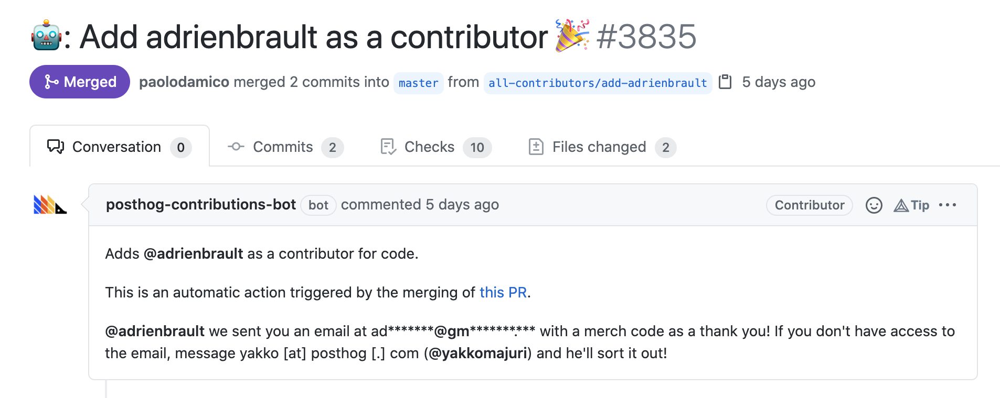

# 🤖 PostHog Contributions Bot



## Credit where credit is due

Big thanks to [All Contributors](https://allcontributors.org/) for the foundations of this bot.

## What this is

This bot is a fork (albeit a largely unrecognizable one) of [all-contributors/app](https://github.com/all-contributors/app), which also leverages a fork of [all-contributors/all-contributors-cli](https://github.com/all-contributors/all-contributors-cli) piublished on npm as [`@posthog/all-contributors-cli`](https://www.npmjs.com/package/@posthog/all-contributors-cli).

## Disclaimer

This bot is currently structured for PostHog use only, so uses a lot of hardcoded values. It also:

- Lacks tests for new functionality
- Follows the existing code patterns of `all-contributors/app`
- Was the product of a one-person effort to ship a working bot in a short amount of time
### Motivation

The original All Contributors GitHub app (bot) allows users to tag the bot somewhere on a repo and request that a contributor be added to that repo's README. 

This bot, however, does **a lot** more. Here are some notable modifications:

#### Functionality

- Automatic PR to add a user to the README following a merged contribution
- Organization-wide access with a centralized repo to host the contributors 
  - i.e. this bot keeps track of contributions on any repo in the PostHog organization and adds the contributor to our main repo `PostHog/posthog`
- Automatic gift card (for PostHog merch) provisioning via email for `code` contributors 
- `extra merch` label handling to provide a larger gift card for bigger contributions
- Keeping track of number of `code` contributions per contributor
- Additional security checks for who can request contributors to be added
- Filtering of organization members from being added as contributors/receiving merch
- Different way of listing contributors on the README (handled by `@posthog/all-contributors-cli`)
- Sends events to PostHog when there are new contributions
#### Architecture

- PostgreSQL connection for handling gift cards and contribution levels 
- Mailgun connection for sending emails
- GitHub API connection for checking list of organization members
- PostHog connection for sending events when there are new contributions
- Webhook also handles `pull_request.closed` events in addition to `issue_comment.created`
- Additional logging and alert emails 
- More control over the Probot server and safer shutdowns
- `app.json` for Heroku deployment

#### Semantics

- Users can mention the bot by tagging @posthog-bot instead of @all-contributors
- PR to add contributors comes from @posthog-contributions-bot
- PostHog-specific replies to messages, PR titles, and PR descriptions

#### Code Quality

- "PostHog-standard" `prettier` formatting

<hr />

## Environment Variables

Documentation for these is a work in progress.

```
APP_ID
WEBHOOK_SECRET
PRIVATE_KEY
WEBHOOK_PROXY_URL
GITHUB_TOKEN
DEBUG
PH_PROJECT_API_KEY
MAILGUN_API_KEY
MAILGUN_DOMAIN
MAILGUN_HOST
TARGET_OWNER
TARGET_REPO
USE_TEST_CODES
DEFAULT_BRANCH
ALLOWED_ORGS
DATABASE_URL
```

## Database

> Note: Schemas are provided as a copy-paste of the creation SQL for now, while I haven't made beautiful Markdown tables for them.

This bot uses a PostgreSQL database with the following 3 tables:

### contributors

Hosts the data on contributors. 

Schema (in the form of creation SQL):

```
CREATE TABLE contributors(
	username CHAR(40) NOT NULL,
	level INT NOT NULL,
	PRIMARY KEY(username)
);
```

### gift_cards

Hosts gift cards manually generated from Shopify. Our plan doesn't give us access to the gift cards API that we could use to generate these on the fly.

Schema (in the form of creation SQL):

```
CREATE TABLE gift_cards(
	token CHAR(30) NOT NULL,
	value INT NOT NULL,
	level INT NOT NULL,
	has_been_used BOOL NOT NULL,
	used_at TIMESTAMP,
	username CHAR(40),
	PRIMARY KEY(token),
	CONSTRAINT fk_username
    FOREIGN KEY(username) 
	  REFERENCES contributors(username)
);
```

### test_gift_cards

Same as above, except this table is used when the `USE_TEST_CODES` environment variable is set to true.

This table on our production bot has been loaded with hundreds of randomly-generated test_gift_cards which aren't valid on Shopify.

## Local Setup

While this bot doesn't have extensive Docs, these are the original instructions for running the All Contributors bot with slight modifications. This is not enough to run the PostHog bot! You also need to set the relevant environment variables - docs coming soon...

> **Important**: If you have a production bot (from All Contributors or PostHog) running in your account you may get duplicated replies to comments, PRs, etc.

### 1. Create a GitHub App for testing

#### 1.1 Go to your GitHub [Developer Settings](https://github.com/settings/developers)

#### 1.2 Create a [new GitHub app](https://github.com/settings/apps/new)

Required fields are:

- `Name`: can be whatever you like, globally unique on GitHub
- `Homepage URL`: can be set to anything
- `Webhook URL`: can be set to anything if you want to manually handle payloads, or the URL of a webhook payload delivery service like smee.io (this is the recommended approach, see final section for details)

Important fields are:

- `Webhook Secret`: set this to `development`
- `Permissions`: set read & write for `Repository contents`, `Issues` and `Pull Requests`, and read for `Repository Metadata`
- `Subscribe to Events`: select `Issue comment` and `Pull request`
- Ensure `Where can this GitHub App be installed?` is set to `only this account`

#### 2. Configure Your GitHub App for testing

You should now have an app created

- On the General Tab, Click `Generate Private Key` and download it for later usage, call it something like `contributorsbot.pem`
- On the Install Tab, Install the app/bot on your user

#### 3. Configure your local server to talk to the GitHub app

Create a file named `.env` with the following template:

```
APP_ID=
WEBHOOK_SECRET=development
PRIVATE_KEY=
```

**Values**

- `APP_ID`: you can get this from the General tab on the developer settings for your app
- `WEBHOOK_SECRET`: leave as `development` (you set this on app setup)
- `PRIVATE_KEY`: when you generated the private key from your app, you should have a `contributorsbot.pem` file locally (or similar). run `openssl base64 < contributorsbot.pem | tr -d '\n' | pbcopy` on the file which will copy the base64 contents onto your clipboard, paste that into the line for `PRIVATE_KEY`

#### 4. Setup a test GitHub repository/with issues PR

- Setup a repository under your name (the name on github where the bot is installed)
- Create an issue
- Comment on the issue: `@posthog-bot please add @yakkomajuri for design and code` (replace @yakkomajuri with your username)

To verify if the bot should have seen this, go to [your app settings](https://github.com/settings/apps/). On the Advanced Tab, see if you have any delivered payloads. **If you're not using a service like smee.io**, copy the payload and save it locally in a file called `test-webhook-payload.json`. Also make note of the headers under the 'Headers' section. 

#### 5. Send your first hook

1. Install the node modules for the bot: `yarn`
2. Run the bot: `yarn start`
3. If you're not using a payload delivery service, send a `POST` request to the bot using the headers you got from the previous step and the content from `test-webhook-payload.json`. If you're using `curl`, this will look something like this:

```
curl -vX POST http://localhost:3000/ -d @test-webhook-payload.json \
--header "Content-Type: application/json" \
--header "User-Agent: GitHub-Hookshot/4d63832" \
--header "X-GitHub-Delivery: 413857f0-8b61-11eb-92be-566b7aa5f6ee" \
--header "X-GitHub-Event: issue_comment" \
--header "X-GitHub-Hook-ID: 297478976" \
--header "X-GitHub-Hook-Installation-Target-ID: 105785" \
--header "X-GitHub-Hook-Installation-Target-Type: integration" \
--header "X-Hub-Signature: sha1=ed222e6750dc2954a422ed8dd371f9da66368104" \
--header "X-Hub-Signature-256: sha256=04d0943f20545ac8df974466c502e4b9743d3618149b03f4ea1a9e658bf31fd0"
```

If there are no errors in the bot console, check your github test issue to see the bot respond :tada:

### Using [smee.io](https://smee.io/)

Alternatively, instead of having to mock the webhook payload using `curl`, you can add an additional environment variable called `WEBHOOK_PROXY_URL` and set it to a [smee.io](https://smee.io) channel URL.

Once you've done that, set the Webhook URL for you app in GitHub to the same channel URL and, after a server restart, your bot will be able to directly respond to incoming webhooks. 
